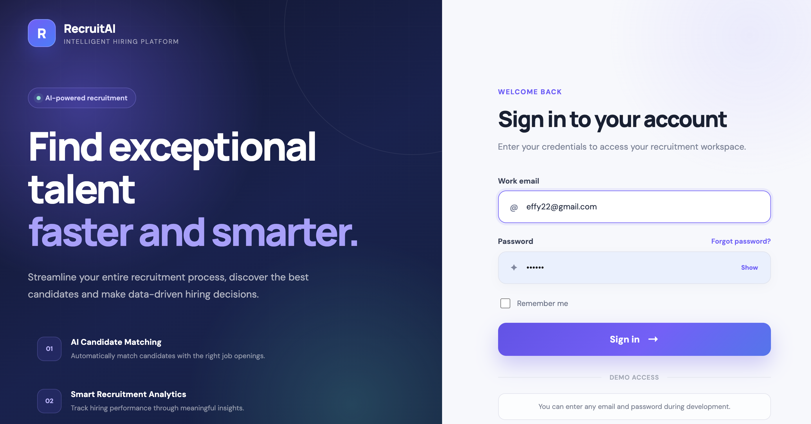
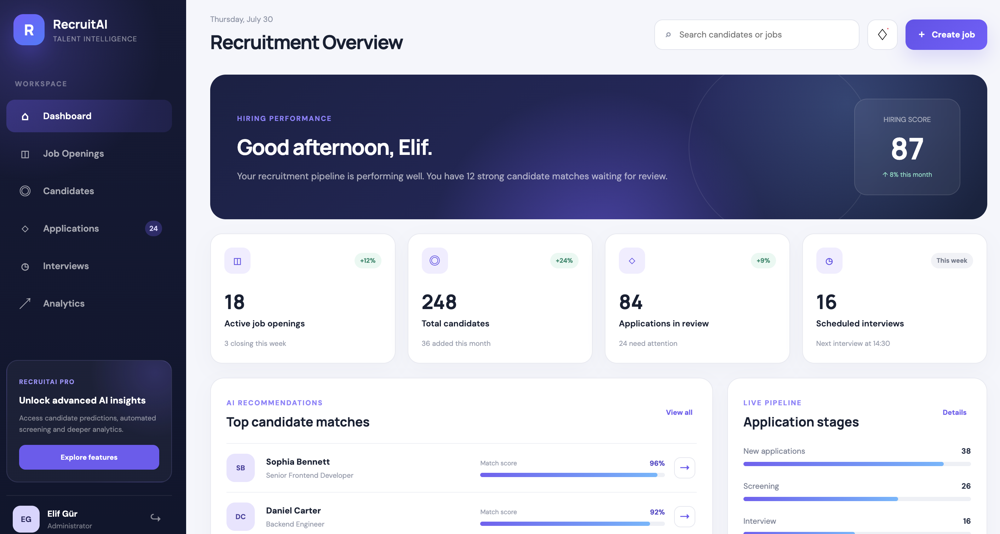

# 🤖 AI Recruitment Platform

An AI-powered recruitment platform that helps recruiters manage job openings, track candidates, and make smarter hiring decisions through an intuitive dashboard.

## ✨ Features

- Modern authentication interface
- Recruitment dashboard
- Job openings management
- Candidate tracking
- AI candidate match score
- Recruitment analytics
- Responsive UI

## 🛠️ Tech Stack

### Frontend

- React 19
- TypeScript
- Vite
- React Router
- CSS3

### Backend *(In Progress)*

- Java 21
- Spring Boot
- Spring Security
- PostgreSQL
- JPA / Hibernate
- JWT Authentication

### AI *(Planned)*

- Resume parsing
- Candidate ranking
- AI-powered job matching
- Skill extraction
- Interview recommendation

---

## 📷 Screenshots

### Login



### Dashboard



---

## 🚀 Getting Started

```bash
git clone https://github.com/elifgur22/ai-recruitment-platform-ui.git

cd ai-recruitment-platform-ui

npm install

npm run dev
```

---

## 📌 Project Status

This project is currently under active development.

Upcoming modules:

- Job Openings
- Candidate Management
- Resume Upload
- AI Matching Engine
- Interview Management
- Analytics Dashboard
- Spring Boot REST API
- PostgreSQL Integration

---

## 👩‍💻 Author

**Elif Yıldırım**

Software Engineer | Java Backend Developer | AI Enthusiast
